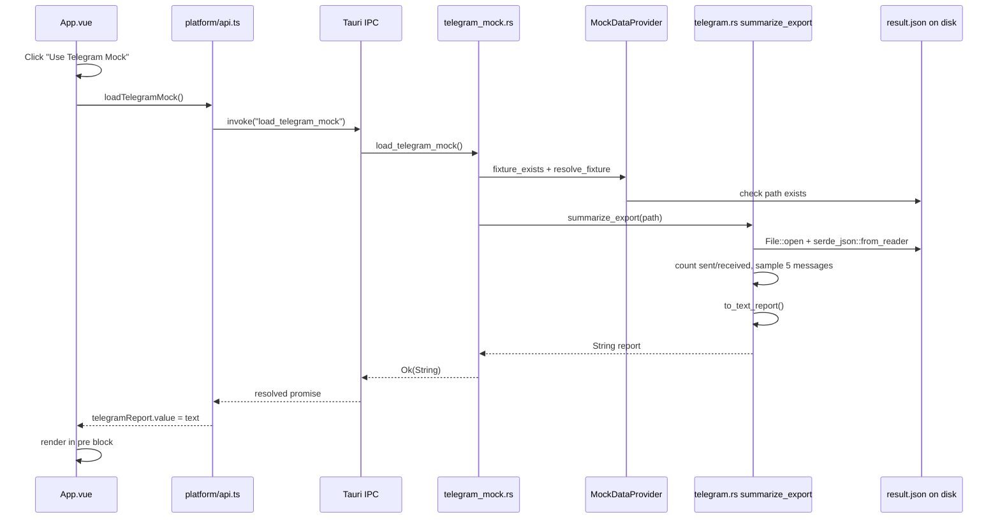

# Telegram Mock Button — End-to-End Flow

## Short answer: Rust or database?

**Everything happens in Rust. No database is used for this button.**

| Approach | Used here? | Why |
|---|---|---|
| **Rust + `serde_json`** | Yes | One-pass parse of your 362 MB `result.json`, count messages in memory, return a text summary |
| **DuckDB** (`AnalyticsEngine`) | No | Opt-in only (`--features analytics`). Not used for this feature. DuckDB struggled with this file shape (nested `chats.list[].messages[]`, heterogeneous `text` field) and its bundled C++ build is heavy on RAM |

DuckDB is still in the project for future OLAP queries (`top_senders`, `messages_by_day`) on simpler export shapes. The Telegram mock button is a separate, lightweight summarizer.

---

## Architecture overview



---

## Layer map

| Layer | File(s) | Role |
|---|---|---|
| UI | `src/App.vue` | Button, loading state, display result |
| Platform API | `src/platform/api.ts` | Tauri vs browser routing, error formatting |
| Tauri shell | `src-tauri/src/lib.rs` | Registers commands |
| Tauri command | `src-tauri/src/commands/telegram_mock.rs` | Thin bridge: find file → call core |
| Mock paths | `crates/core/src/mock/provider.rs` | Resolve fixture file on disk |
| Business logic | `crates/core/src/parsers/telegram.rs` | Parse JSON, aggregate stats, format text |
| Data file | `crates/core/src/mock/telegram/result.json` | Your Telegram export (gitignored) |

---

## Step-by-step walkthrough

### Step 1 — User clicks the button

**File:** [`src/App.vue`](../src/App.vue) (template, ~line 58–68)

```html
<button @click="useTelegramMock" :disabled="telegramLoading">
  {{ telegramLoading ? "Loading…" : "Use Telegram Mock" }}
</button>
<pre v-if="telegramReport">{{ telegramReport }}</pre>
```

**What happens:**
- `@click` calls `useTelegramMock()`
- Button shows "Loading…" and is disabled while work runs
- Result goes into `<pre>` as plain text

**Why:** Simple feedback for a slow operation (362 MB JSON can take 10–30 seconds).

---

### Step 2 — Vue handler resets state and calls the API

**File:** [`src/App.vue`](../src/App.vue) (`useTelegramMock`, lines 20–30)

```typescript
telegramLoading.value = true;
telegramReport.value = "";
telegramError.value = "";
telegramReport.value = await loadTelegramMock();
```

**Why:** Clear previous output/errors; `await` keeps the UI responsive during the Rust work (Tauri runs the command on a background thread).

---

### Step 3 — Platform API routes to Tauri (not WASM/browser)

**File:** [`src/platform/api.ts`](../src/platform/api.ts) (`loadTelegramMock`, lines 37–44)

```typescript
if (isTauri()) {
  return invoke<string>("load_telegram_mock");
}
throw new Error("Telegram mock loading requires the desktop app...");
```

**What happens:**
- In the **Tauri desktop app**: `invoke` sends an IPC message to Rust
- In **browser** (`localhost`): throws — no filesystem access for a 362 MB local file

**Why:** Reading local export files needs the Tauri/Rust backend. WASM in the browser can't access arbitrary paths on disk.

---

### Step 4 — Tauri dispatches to the registered command

**File:** [`src-tauri/src/lib.rs`](../src-tauri/src/lib.rs) (lines 7–10)

```rust
.invoke_handler(tauri::generate_handler![
    commands::greet::greet,
    commands::telegram_mock::load_telegram_mock,
])
```

**What happens:** Tauri matches `"load_telegram_mock"` to the Rust function in `telegram_mock.rs`.

**Why:** Commands are the boundary between the WebView (Vue) and native Rust.

---

### Step 5 — Tauri command finds the mock file

**File:** [`src-tauri/src/commands/telegram_mock.rs`](../src-tauri/src/commands/telegram_mock.rs)

```rust
let mock = MockDataProvider::from_manifest_dir();
let relative = "telegram/result.json";

if !mock.fixture_exists(relative) { return Err(...); }
let path = mock.resolve_fixture(relative);

summarize_export(&path)
    .map(|summary| summary.to_text_report())
    .map_err(|e| e.to_string())
```

**What happens:**
1. Build a `MockDataProvider` (paths rooted at `app-core` crate dir)
2. Check that `telegram/result.json` exists
3. Resolve the absolute path
4. Call `summarize_export`, format as text, return `String` to the frontend

**Why:** The command stays thin; logic lives in `app-core` so it can be reused (tests, CLI, Android later) without Tauri.

---

### Step 6 — MockDataProvider resolves the file path

**File:** [`crates/core/src/mock/provider.rs`](../crates/core/src/mock/provider.rs) (`resolve_fixture`, lines 132–154)

Searches in order:
1. `crates/core/mock/telegram/result.json` (canonical)
2. `crates/core/src/mock/telegram/result.json` (where your file is)

Uses `env!("CARGO_MANIFEST_DIR")` — compile-time path to `crates/core/`.

**Why two locations:** Plan expected `crates/core/mock/`; your export landed under `src/mock/`. Fallback avoids a manual move.

---

### Step 7 — Rust opens and parses the entire JSON file

**File:** [`crates/core/src/parsers/telegram.rs`](../crates/core/src/parsers/telegram.rs) (`summarize_export`, lines 147–236)

```rust
let file = File::open(path)?;
let reader = BufReader::with_capacity(256 * 1024, file);
let export: RawExport = serde_json::from_reader(reader)?;
```

**What happens:**
1. Read file size from metadata
2. Stream-read with a 256 KB buffer
3. Deserialize into `RawExport` — only fields we care about:

| Struct field | Used for |
|---|---|
| `about` | About preview (first 200 chars) |
| `personal_information` | Name, username, `user_id` for sent/received |
| `chats.list[].messages[]` | Message counts and samples |

Fields like `contacts`, `stories`, `sessions` are **skipped** by serde (not in the struct).

**Why Rust + serde_json, not DuckDB:**
- Your export is one huge nested JSON object (`chats.list[].messages[]`), not a flat `messages[]` array
- `text` is sometimes a string, sometimes an array of rich-text objects — awkward for DuckDB `read_json_auto`
- DuckDB `bundled` compiles hundreds of MB of C++ and can freeze the machine
- A single Rust pass: open → parse → count → return text. No DB setup, no extra disk, no query engine

**Trade-off:** The full file is loaded into memory during parse (~362 MB on disk → more in RAM). Acceptable for a dev mock button; production would use streaming/chunked parsing or per-chat files.

---

### Step 8 — Aggregate statistics in Rust

**File:** [`crates/core/src/parsers/telegram.rs`](../crates/core/src/parsers/telegram.rs) (lines 185–223)

```rust
for chat in &chat_list {
    for msg in &chat.messages {
        if msg.msg_type != "message" { continue; }
        total_messages += 1;

        if msg.from_id == me_id { sent_messages += 1; }

        // collect up to 5 sample message snippets
    }
}
received_messages = total_messages - sent_messages;
```

**Sent vs received logic:**
- `me_id` = `"user" + personal_information.user_id` (e.g. `"user302402513"`)
- If `message.from_id == me_id` → **sent**
- Otherwise → **received**

**Sample messages:** First 5 non-empty texts, flattened via `value_to_plain_text()` (handles string or rich-text array), truncated to 80 chars, prefixed with sender name.

**Why in Rust loops, not SQL:** We're already in memory after parse; counting is O(n) and simple. No need for DuckDB here.

---

### Step 9 — Format as plain text

**File:** [`crates/core/src/parsers/telegram.rs`](../crates/core/src/parsers/telegram.rs) (`to_text_report`, lines 100–131)

Produces output like:

```
Telegram Export Summary
=======================
Account : Mohsen (@MohsenDastaran)
About   : Here is the data you requested...
File    : 346.0 MB

Chats            : 184
Total messages   : 123456
  Sent           : 60000
  Received       : 63456

Sample messages:
  Alice: hi there
  ...
```

**Why plain text:** You asked for "not fancy, just text". A `String` crosses the Tauri boundary easily; Vue renders it in `<pre>`.

---

### Step 10 — Result travels back to the UI

**Path:** `telegram_mock.rs` → Tauri IPC → `api.ts` → `App.vue`

```typescript
telegramReport.value = await loadTelegramMock();
```

On error, `formatInvokeError()` in `api.ts` handles Tauri rejections (often plain strings, not `Error` objects).

**File:** [`src/App.vue`](../src/App.vue) — `telegramError` shown in `<p>`, `telegramReport` in `<pre>`.

---

## What is NOT involved

| Component | Status | Notes |
|---|---|---|
| **DuckDB** | Not used | Opt-in via `--features analytics`; disabled by default |
| **`AnalyticsEngine`** | Not used | For future `top_senders()` etc. on simpler schemas |
| **`PlatformParser` trait** | Not used | Telegram parser in `detector.rs` is still a stub |
| **WASM** | Not used | Browser can't read local 362 MB files |
| **Database / SQLite** | Not used | Everything is in-memory Rust |

---

## Future: when DuckDB would be used

**Files:** [`crates/core/src/storage/engine.rs`](../crates/core/src/storage/engine.rs), [`crates/core/src/analytics/queries.rs`](../crates/core/src/analytics/queries.rs)

DuckDB fits when you have:
- Normalized `UniversalMessage` rows in memory or on disk
- Repeated aggregations (`top senders`, `messages per day`)
- Simpler JSON shapes (e.g. single-chat `result.json` with top-level `messages[]`)

Enable with:

```bash
bun run tauri dev -- --features analytics
```

The Telegram mock button intentionally bypasses that stack for a quick, self-contained summary.

---

## File dependency diagram

```
src/App.vue
    └── src/platform/api.ts
            └── Tauri IPC: "load_telegram_mock"
                    └── src-tauri/src/commands/telegram_mock.rs
                            ├── crates/core/src/mock/provider.rs  (find file)
                            └── crates/core/src/parsers/telegram.rs  (parse + summarize)
                                    └── crates/core/src/mock/telegram/result.json  (your data)
```

---

## Summary

1. **Click** → Vue handler in `App.vue`
2. **Route** → `loadTelegramMock()` in `api.ts` → Tauri `invoke`
3. **Command** → `telegram_mock.rs` finds file via `MockDataProvider`
4. **Parse** → `telegram.rs` reads entire JSON with `serde_json` in Rust
5. **Aggregate** → count sent/received, sample 5 messages in Rust loops
6. **Format** → `to_text_report()` → plain `String`
7. **Display** → string returned over IPC → shown in `<pre>` in Vue

**All processing is in Rust, in memory, no database.** DuckDB exists in the project for future analytics but is deliberately not used here — for performance, simplicity, and compatibility with your export format.
